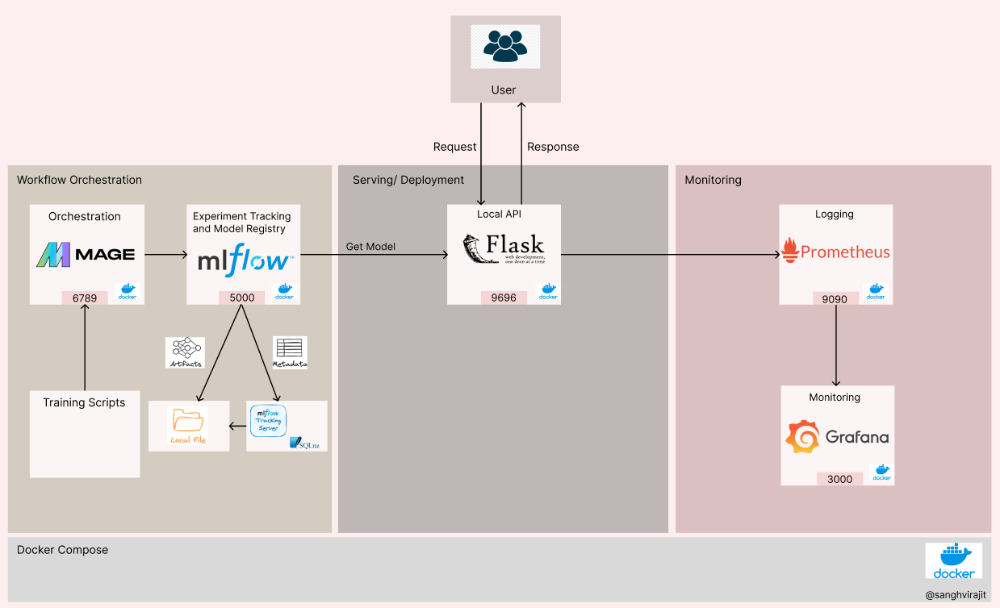
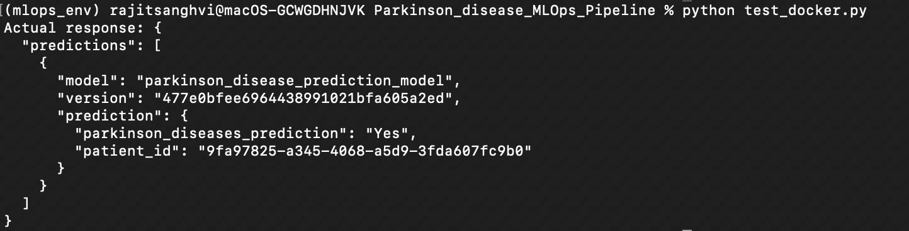
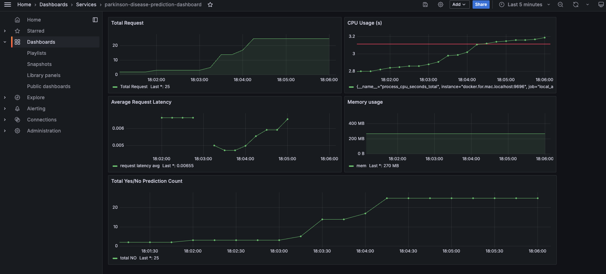
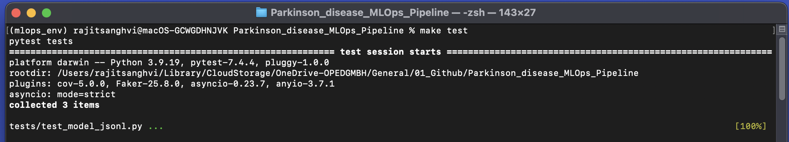
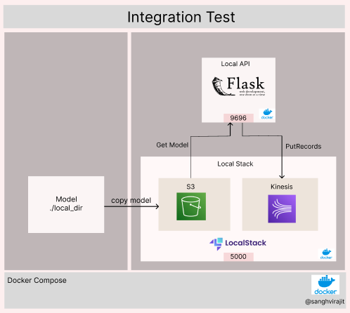
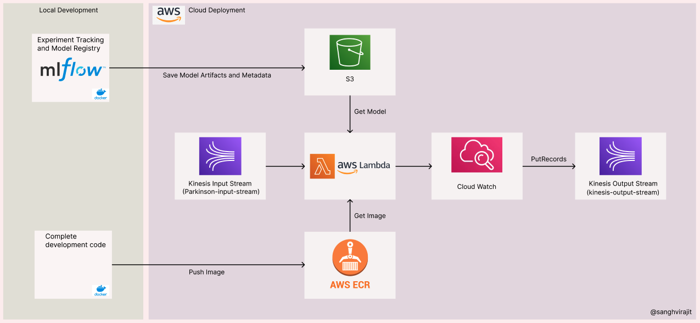
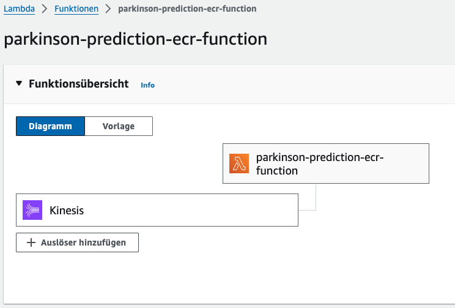
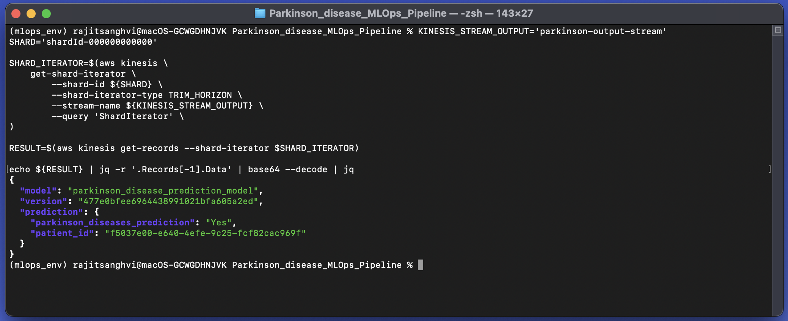
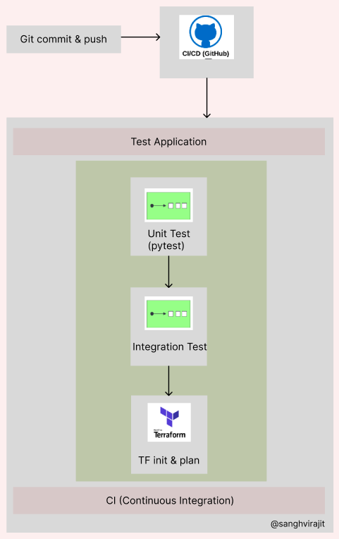
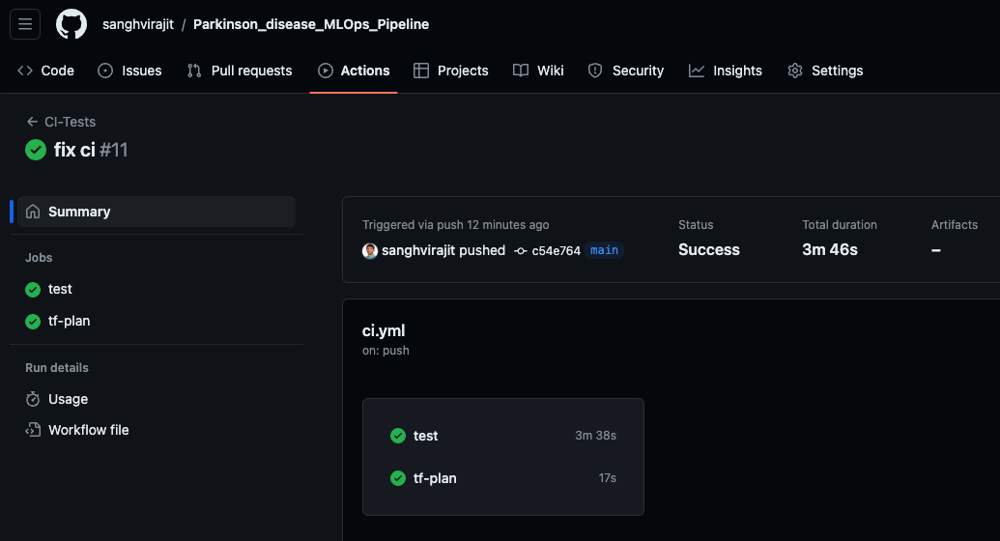

# Parkinson-Disease---MLOps Pipeline

This repository contains a simplified MLOps platform (including training, serving and monitoring).
The goal of this project was to show what MLOps tool do and how they work together.

This project was inspired by the [MLOps Zoomcamp](https://github.com/DataTalksClub/mlops-zoomcamp) course provided by [DataTalks.Club](https://datatalks.club/).

# Context

Parkinson Disease is a brain neurological disorder. It leads to shaking of the body, hands and provides stiffness to the body. No proper cure or treatment is available yet at the advanced stage. Treatment is possible only when done at the early or onset of the disease. These will not only reduce the cost of the disease but will also possibly save a life. Most methods available can detect Parkinson in an advanced stage; which means loss of approx.. 60% dopamine in basal ganglia and is responsible for controlling the movement of the body with a small amount of dopamine. More than 145,000 people have been found alone suffering in the U.K and in India, almost one million population suffers from this disease and it’s spreading fast in the entire world.

The main objective of this project is to understand what is Parkinson’s disease and to detect the early onset of the disease and to apply what has been learned during the MLOps Zoomcamp course to build a MLOps pipeline for Parkinson-Disease Prediction.

# Dataset

This dataset comprises comprehensive health information for 2,105 patients diagnosed with Parkinson's Disease, each uniquely identified with IDs ranging from 3058 to 5162. The dataset includes demographic details, lifestyle factors, medical history, clinical measurements, cognitive and functional assessments, symptoms, and a diagnosis indicator. This dataset is valuable for researchers and data scientists aiming to explore factors associated with Parkinson's Disease, develop predictive models, and conduct statistical analyses.

The original dataset is available at [here](https://www.kaggle.com/datasets/rabieelkharoua/parkinsons-disease-dataset-analysis/data)

### Dataset Overview

Demographic Details

1. PatientID: A unique identifier assigned to each patient (3058 to 5162).
2. Age: The age of the patients ranges from 50 to 90 years.
3. Gender: Gender of the patients, where 0 represents Male and 1 represents Female.
4. Ethnicity: The ethnicity of the patients, coded as follows:
   A. Caucasian
   B. African American
   C. Asian
   D. Other
5. EducationLevel: The education level of the patients, coded as follows:
   A. None
   B: High School
   C. Bachelor's
   D. Higher

Lifestyle Factors

1. BMI: Body Mass Index of the patients, ranging from 15 to 40.
2. Smoking: Smoking status, where 0 indicates No and 1 indicates Yes.
3. AlcoholConsumption: Weekly alcohol consumption in units, ranging from 0 to 20.
4. PhysicalActivity: Weekly physical activity in hours, ranging from 0 to 10.
5. DietQuality: Diet quality score, ranging from 0 to 10.
6. SleepQuality: Sleep quality score, ranging from 4 to 10.

Medical History

1. FamilyHistoryParkinsons: Family history of Parkinson's Disease, where 0 indicates No and 1 indicates Yes.
2. TraumaticBrainInjury: History of traumatic brain injury, where 0 indicates No and 1 indicates Yes.
3. Hypertension: Presence of hypertension, where 0 indicates No and 1 indicates Yes.
4. Diabetes: Presence of diabetes, where 0 indicates No and 1 indicates Yes.
5. Depression: Presence of depression, where 0 indicates No and 1 indicates Yes.
6. Stroke: History of stroke, where 0 indicates No and 1 indicates Yes.

Clinical Measurements

1. SystolicBP: Systolic blood pressure, ranging from 90 to 180 mmHg.
2. DiastolicBP: Diastolic blood pressure, ranging from 60 to 120 mmHg.
3. CholesterolTotal: Total cholesterol levels, ranging from 150 to 300 mg/dL.
4. CholesterolLDL: Low-density lipoprotein cholesterol levels, ranging from 50 to 200 mg/dL.
5. CholesterolHDL: High-density lipoprotein cholesterol levels, ranging from 20 to 100 mg/dL.
6. CholesterolTriglycerides: Triglycerides levels, ranging from 50 to 400 mg/dL.

Cognitive and Functional Assessments

1. UPDRS: Unified Parkinson's Disease Rating Scale score, ranging from 0 to 199. Higher scores indicate greater severity of the disease.
2. MoCA: Montreal Cognitive Assessment score, ranging from 0 to 30. Lower scores indicate cognitive impairment.
3. FunctionalAssessment: Functional assessment score, ranging from 0 to 10. Lower scores indicate greater impairment.

Symptoms

1. Tremor: Presence of tremor, where 0 indicates No and 1 indicates Yes.
2. Rigidity: Presence of muscle rigidity, where 0 indicates No and 1 indicates Yes.
3. Bradykinesia: Presence of bradykinesia (slowness of movement), where 0 indicates No and 1 indicates Yes.
4. PosturalInstability: Presence of postural instability, where 0 indicates No and 1 indicates Yes.
5. SpeechProblems: Presence of speech problems, where 0 indicates No and 1 indicates Yes.
6. SleepDisorders: Presence of sleep disorders, where 0 indicates No and 1 indicates Yes.
7. Constipation: Presence of constipation, where 0 indicates No and 1 indicates Yes.
8. Diagnosis: Diagnosis status for Parkinson's Disease, where 0 indicates No and 1 indicates Yes.
9. DoctorInCharge: This column contains confidential information about the doctor in charge, with "DrXXXConfid" as the value for all patients.

# How to use

Prerequisite: Install Docker & Docker Compose

Download repository from GitHub

```bash
git clone https://github.com/sanghvirajit/Parkinson-Disease---MLOps-Pipeline.git
cd Parkinson-Disease---MLOps-Pipeline
pip install -r requirements.txt
```

# linting and formatting

All the dependencies for linter are written in the requirements.ci.txt. Lint section is also added in the Makefile.

Run the following code to use it

```bash
pip install -r requirements.ci.txt
Make lint
```

It should give following results:


# MLOps pipeline



## Running the Docker Compose

To start the docker compose run the following commands in terminal

```bash
./scripts/start.sh
```

The command will start the docker compose.

### Access individual services

```bash
mage: http://localhost:6789
mlflow: http://localhost:5000
local_api (local testing): http://localhost:9696
Prometheus: http://localhost:9090
Grafana: http://localhost:3000
```

# Mage as Orchestration

Mage is employed for the workflow orchestration. Mage can be accessible at ``` http://localhost:5000 ```. Under the Pipelines, 4 Pipelines for the training of Linear Regression, Logistic Regression, XGBoost and CatBoost models are implemented.


Example pipeline blocks for the CatBoost Model:


# MLFlow for Experiemental Tracking

Linear Regression, Logistic Regression, XGBoost and CatBoost models were tested. The main focus of the project was not to find the best model but to work on the best MLOps technologies so the best model amoung the 4 was choosen. CatBoost was not anyway giving bad results. The Accuracy of the CatBoost Model is 96% with RMSE of 0.20.

Mage is source in the MLFlow experiement tracking.


All the experiements were logged in the MLFLOW which can be access at ``` http://localhost:5000 ```. The Best Models among the XGBoost and CatBoost were registred with the MLFLow model registry.

CatBoost Model can be find under "Production" tag and XGBoost Model can be find under "Staging".


# Save the Artifacts of the best model from the MLFlow Registry to S3 Bucket on AWS

The artifacts of the best model (CatBoost) was then loaded and save to the AWS S3 Bucket with it's run_id (eg. path run_id/artifacts) manually (can be find under app/notebook.ipynb), from where it will be loaded later during the cloud deployment.

## Putting everything to Docker

### Configuring AWS and other environment variables

```bash
export AWS_DEFAULT_REGION="YOUR_REGION"
export AWS_ACCESS_KEY_ID="YOUR_ACCESS_KEY"
export AWS_SECRET_ACCESS_KEY="YOUR_SECRET_KEY"

export RUN_ID="477e0bfee6964438991021bfa605a2ed"
export MODEL_BUCKET="s3-parkinson-disease-prediction"
export PREDICTIONS_STREAM_NAME="parkinson-output-stream"
```

### Running the docker with Lambda and Kinesis

```bash
docker build -t parkinson-disease-prediction:latest .

docker run -it --rm \
    -p 8080:8080 \
    -e AWS_DEFAULT_REGION="${AWS_DEFAULT_REGION}" \
    -e AWS_ACCESS_KEY_ID="${AWS_ACCESS_KEY_ID}" \
    -e AWS_SECRET_ACCESS_KEY="${AWS_SECRET_ACCESS_KEY}" \
    -e MODEL_LOCATION="/app/model" \
    -e RUN_ID="${RUN_ID}" \
    -e MODEL_BUCKET="${MODEL_BUCKET}" \
    -e PREDICTIONS_STREAM_NAME="${PREDICTIONS_STREAM_NAME}" \
    -v $(pwd)/model:/app/model \
    parkinson-disease-prediction:latest
```

to test the docker, run the following command:

```bash
python test_docker.py
```



# Logging and Monitoring

Prometheus is integrated for logging metrics, whichca be accessible ``` http://localhost:9090 ```.
Grafrana is integrated for monitoring metrics, dashboard can be accessible at ``` http://localhost:3000 ```, enter ``` username/password ``` as ``` admin/admin ```.

A example dashboard with few panels is already saved,



```bash
http://localhost:3000/dashboard/snapshot/6t5VD3vSDKttyhRh0nhaoWKOOdiksZcB
```

Initially dashboad would be empty except CPU Usage and Momeory usage metrics.

Once docker compose is up, try sending few local request (eg 10 recommended) using following command, and it will be reflected into the dashboad (wait for 15s and then refreash the dashboard)

```bash
python test_local.py
```

# Unit Test

In this project, unit testing is implemented uniquely. Under the tests/assets directory, there are five test cases, each named ``` {filename}_{groundtruth}.txt ```.

With the model saved locally in the model/ directory, all five test cases are executed to ensure that the actual predictions match the provided ground truth. This approach guarantees that any updates to the model consistently pass these predefined test cases, maintaining reliability and accuracy.

To run the unit test, execute the following command:

```bash
make test
```



# Integration Test



Localstack is used for integration testing, with S3 and Kinesis set up within Localstack for end-to-end testing.

The model, stored locally, will be saved to S3 in Localstack. From there, it will be loaded, and records will be sent to the output-kinesis stream in Kinesis within Localstack.

To run the integration test, execute the following command:

```bash
make integration_test
```

# AWS Deployment



AWS credentials can be set as Enviromental Variables as follow

```bash
export AWS_ACCESS_KEY_ID="AWS_ACCESS_KEY_ID"
export AWS_SECRET_ACCESS_KEY="AWS_SECRET_ACCESS_KEY"
export AWS_DEFAULT_REGION="AWS_DEFAULT_REGION"
```



### Sending actual data to kinesis stream

```bash
KINESIS_STREAM_INPUT=parkinson-input-stream
aws kinesis put-record \
   --stream-name ${KINESIS_STREAM_INPUT} \
   --partition-key 1 \
   --data '{
            "data": {
                  "Age": 67,
                  "Gender": "1",
                  "Ethnicity": "2",
                  "EducationLevel": "1",
                  "BMI": 24.77259403457728,
                  "Smoking": "0",
                  "AlcoholConsumption": 13.941385740391004,
                  "PhysicalActivity": 2.472534322357399,
                  "DietQuality": 9.593309739128369,
                  "SleepQuality": 6.060992120577725,
                  "FamilyHistoryParkinsons": "0",
                  "TraumaticBrainInjury": "0",
                  "Hypertension": "1",
                  "Diabetes": "0",
                  "Depression": "0",
                  "Stroke": "0",
                  "SystolicBP": 92,
                  "DiastolicBP": 60,
                  "CholesterolTotal": 193.1381868106296,
                  "CholesterolLDL": 137.5175503762128,
                  "CholesterolHDL": 25.482467035806813,
                  "CholesterolTriglycerides": 313.66674876926953,
                  "UPDRS": 58.99092096333794,
                  "MoCA": 19.902233615718146,
                  "FunctionalAssessment": 5.104914484020905,
                  "Tremor": "0",
                  "Rigidity": "1",
                  "Bradykinesia": "1",
                  "PosturalInstability": "0",
                  "SpeechProblems": "0",
                  "SleepDisorders": "1",
                  "Constipation": "0"
               },
            "patient_id": "f5037e00-e640-4efe-9c25-fcf82cac969f"
         }'
```

### Reading the output from the stream

```bash
KINESIS_STREAM_OUTPUT='parkinson-output-stream'
SHARD='shardId-000000000000'

SHARD_ITERATOR=$(aws kinesis \
    get-shard-iterator \
        --shard-id ${SHARD} \
        --shard-iterator-type TRIM_HORIZON \
        --stream-name ${KINESIS_STREAM_OUTPUT} \
        --query 'ShardIterator' \
)

RESULT=$(aws kinesis get-records --shard-iterator $SHARD_ITERATOR)

echo ${RESULT} | jq -r '.Records[-1].Data' | base64 --decode | jq
```



# IaC - Terraform

Terraform has also been used for provisioning the infrastructure. Only Staging environment will be deployed once run.
Terraform can be executed with following commands and has also been added under the CI pipeline.

```bash
cd infrastructure
terraform init
terraform plan --var-file vars/stg.tfvars
terraform apply --var-file vars/stg.tfvars
```

Note: While running terraform apply please make sure to uncomment the lambda function in the first run. (Please run only untill the ECR resource). We have to manually push any base image to the ECR because Lambda need atleast one image to pull. lambda config would fail without an existing Image URI in ECR.

Please run the terraform apply without lambda resource, and push the base image manually by running following commands.

```bash
docker build -t parkinson-disease-prediction:latest .

$(aws ecr get-login --no-include-email)

REMOTE_URI="058264402883.dkr.ecr.eu-central-1.amazonaws.com/stg_ecr_parkinson-disease-prediction"
REMOTE_TAG="latest"
REMOTE_IMAGE=${REMOTE_URI}:${REMOTE_TAG}

LOCAL_IMAGE="parkinson-disease-prediction:latest"
docker tag ${LOCAL_IMAGE} ${REMOTE_IMAGE}
docker push ${REMOTE_IMAGE}
```

now please re-run the terraform apply with lambda resources.

# Continuous Integration and Continuous Deployment



CI pipeline can be find under .github/ci.yml
CI pipeline once triggered during a pull request, it will run the unit test (pytest), integartion test and terraform plan.

example of how a successfull ci run looks like, more can be found under the github actions.


CD pipeline has been skipped in this project!

All the AWS resources will be deleted after the peer-review week.
Thank you for evaluating the project!